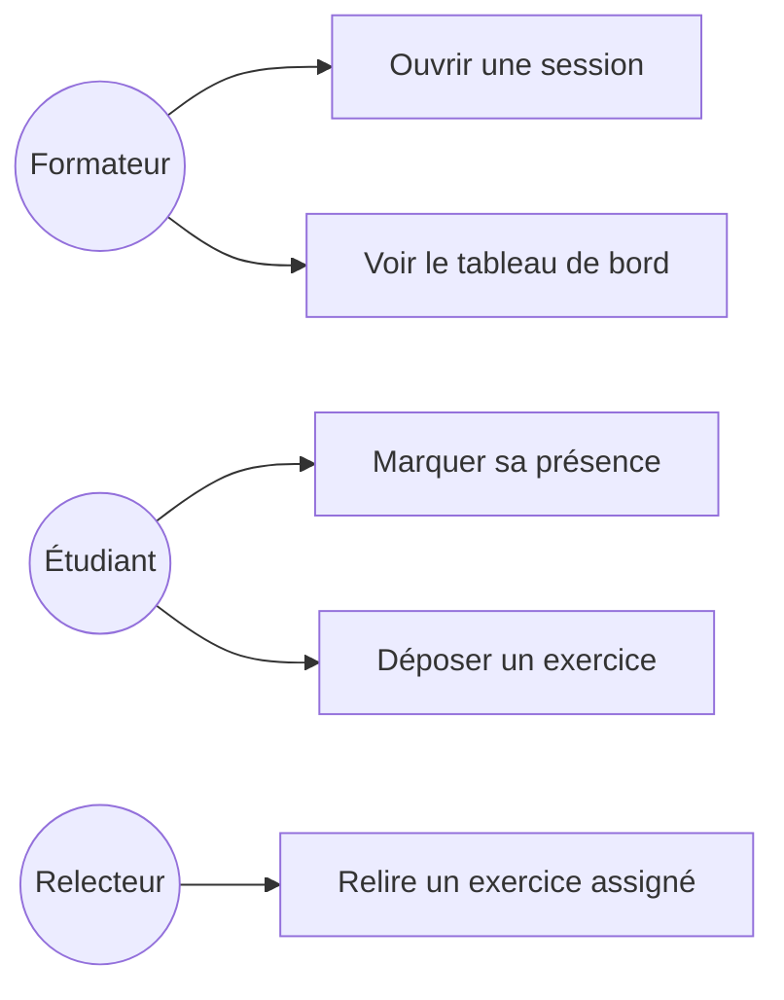

# D1 — Cas d'utilisation

> À compléter : les acteurs (Formateur, Étudiant, Relecteur) et ce que
> chacun peut faire, en Mermaid (`graph` ou `flowchart`) ou PlantUML texte.

```mermaid
flowchart LR
    Formateur((Formateur))
    Etudiant((Étudiant))
    Relecteur((Relecteur))

    Formateur --> UC1[Ouvrir une session]
    Formateur --> UC2[Voir le tableau de bord]
    Etudiant --> UC3[Marquer sa présence]
    Etudiant --> UC4[Déposer un exercice]
    Relecteur --> UC5[Relire un exercice assigné]
```
