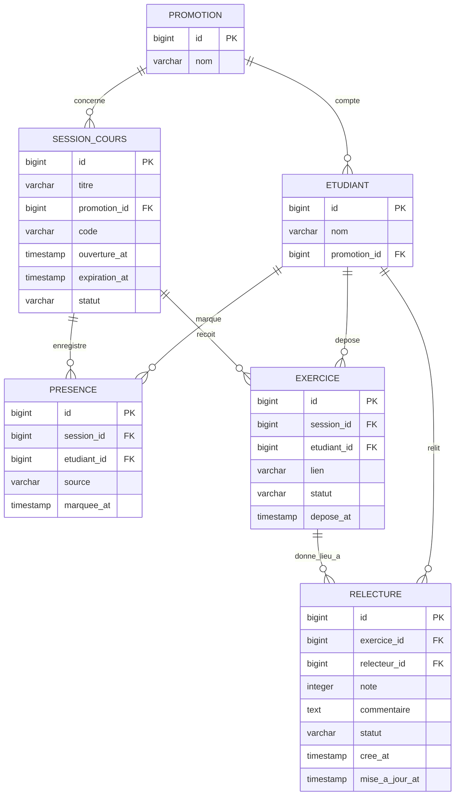

# D2 — Modèle de données

> Doit correspondre à `backend/src/main/resources/db/migration/V1__init.sql`
> (base) puis `V3__deux_relecteurs_moyenne_provisoire.sql` (changement de
> besoin). Si tu modifies le schéma, mets ce diagramme à jour dans le même commit.

**V3 — changement de besoin :** la relation EXERCICE–RELECTURE passe de
`||--o|` (un seul relecteur, contrainte `uk_relecture_exercice`) à `||--o{`
(jusqu'à deux relecteurs, contrainte `uk_relecture_exercice_relecteur` sur le
couple exercice/relecteur). La moyenne du tableau de bord devient
**provisoire** tant que des relectures restent en attente.
