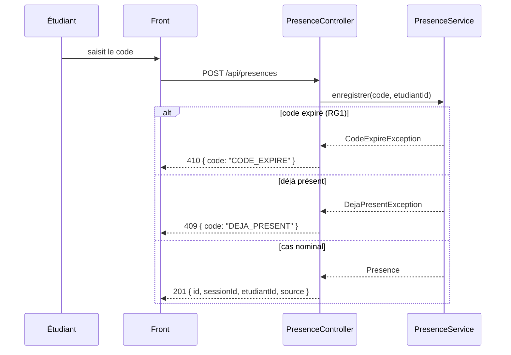

# D3 — Séquence : marquer sa présence

> Squelette repris du sujet (Annexe C). Adapte-le à tes propres décisions
> (RG1 pour l'expiration, format d'erreur imposé) — il doit correspondre
> exactement aux codes HTTP du contrat `api/contrat.yaml`.

